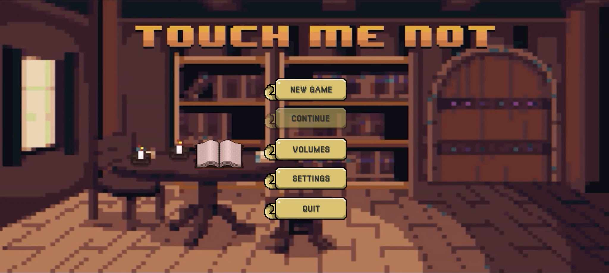
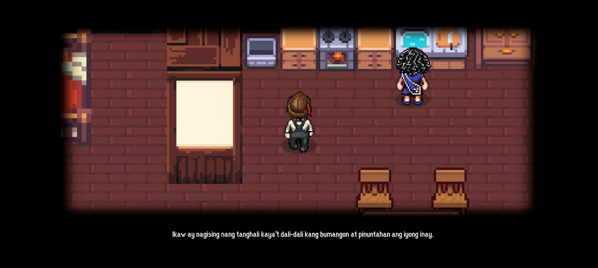
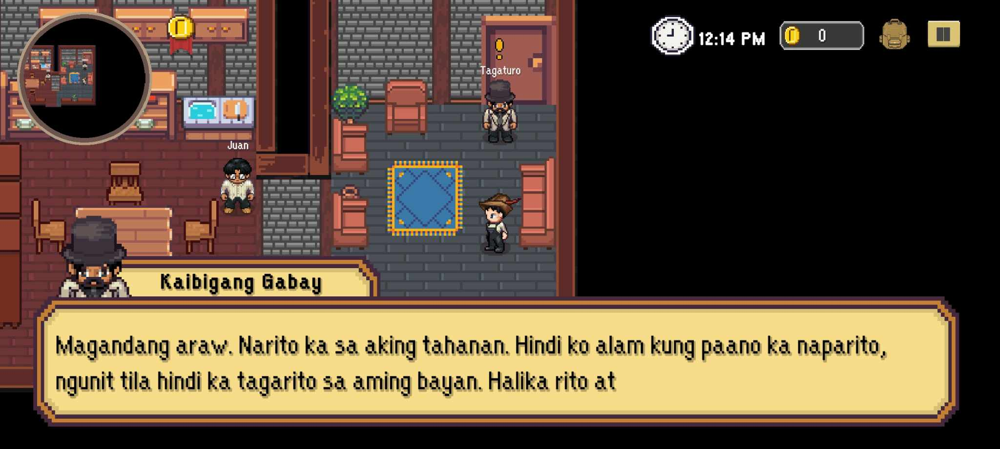
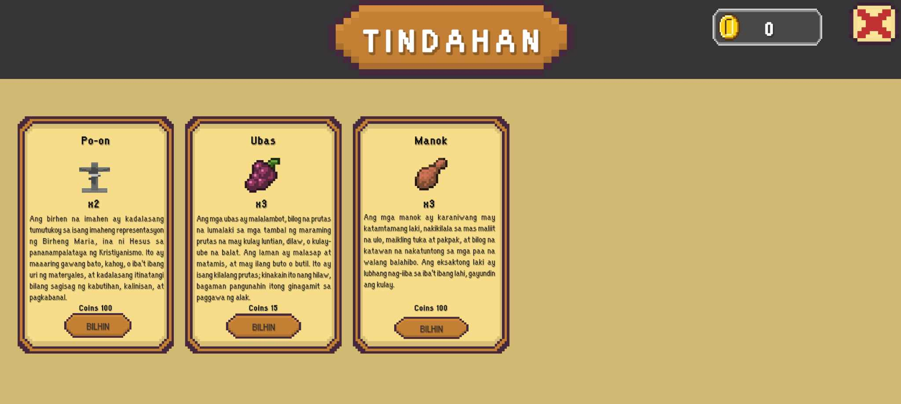

# Touch Me Not


## Overview

**Touch Me Not** is a Filipino 2D RPG game developed using Unity (version 2022.3.8f1), inspired by the novel *Noli Me Tangere*. Dive into a rich, narrative-driven adventure where you complete quests, interact with intriguing NPCs, shop for essential items, and explore different chapters and worlds.

## Features

- **Immersive Storyline**: Experience a deep and engaging story inspired by *Noli Me Tangere*.
- **Quests and Missions**: Complete a variety of quests that drive the story forward and unlock new areas.
- **NPC Interactions**: Engage with a diverse cast of characters, each with their own stories and personalities.
- **Item Shops**: Purchase items to help you on your quests from various shops.
- **Chapter Progression**: Advance through different chapters, each offering new challenges and environments.

## Screenshots






## Technologies Used

- **Unity**: For game development and engine.
- **C#**: For scripting and game logic.
- **Aseprite**: For creating 2D sprite assets.
- **Ink script**: For interactive quiz dialogue system.

## Getting Started

**NOTE:** The complete files were not uploaded. If you wish to obtain the full files, please contact via email, which can be found at the bottom of this section.

### Prerequisites

Make sure you have the following installed:

- [Unity](https://unity.com/download) (version 2022.3.8f1)
- [Git](https://git-scm.com/)

### Installation

1. Clone the repository:

    ```bash
    git clone https://github.com/jamescasipong/Touch-Me-Not.git
    ```

2. Open the project in Unity:

    - Open Unity Hub.
    - Click on "Add" and navigate to the cloned project folder.
    - Select the folder and click "Open".

3. Press the play button in Unity to start the game.

## How to Play

Note: This game is made specifically for Android users. However, if you want to play it on PC, the hotkeys are as follows:

- **Movement**: Use the arrow keys or WASD to move your character.
- **Interact**: Press `F` to interact with NPCs and objects.
- **Inventory**: Press `I` to open your inventory.
- **Menu**: Press `ESC` to open the game menu.

## Contributing

We welcome contributions from the community! To contribute:

1. Fork the repository.
2. Create a new branch:

    ```bash
    git checkout -b feature/your-feature-name
    ```

3. Make your changes.
4. Commit your changes:

    ```bash
    git commit -m "Add your feature"
    ```

5. Push to the branch:

    ```bash
    git push origin feature/your-feature-name
    ```

6. Open a pull request.

## Roadmap

- [ ] Implement more side quests.
- [ ] Add more interactive NPCs.
- [ ] Expand the item shop with more items.
- [ ] Introduce new chapters and worlds.

## License

This project is licensed under the MIT License. See the [LICENSE](LICENSE) file for details.

## Contact

For any inquiries or feedback, feel free to reach out:

- **Email**: jamesxcasipong@gmail.com

---

Feel free to add your Twitter handle or any other contact information as needed.
